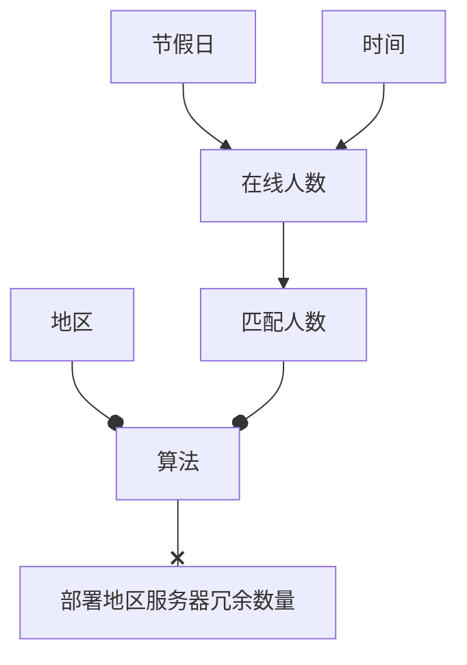
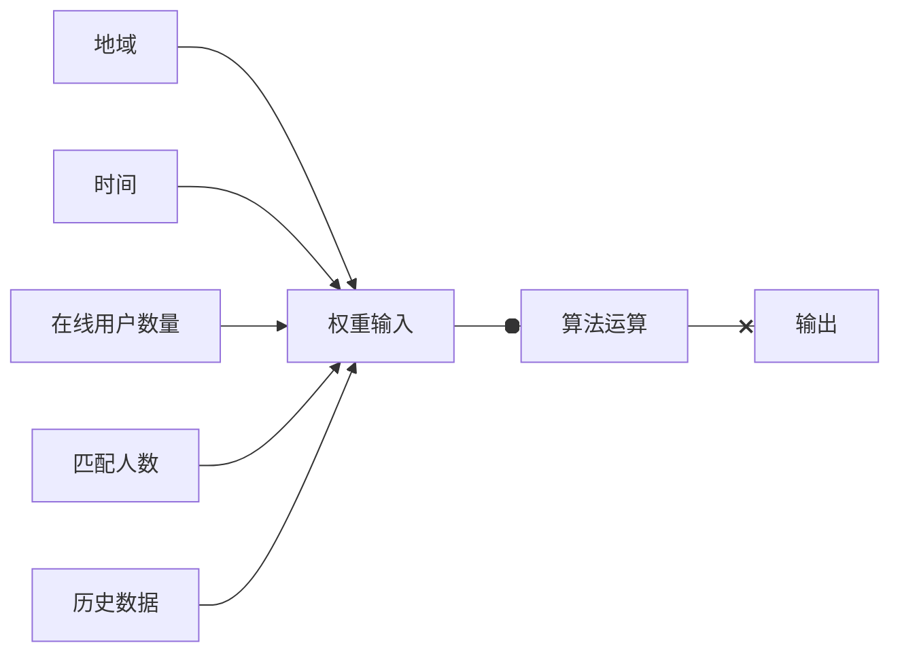

###  
PID算法协处理

> 处理场景

	在更好的为用户提供服务时,进一步降低运维成本,合理的分配服务器冗余数量.顾借助PID算法协助处理.

## 场景

>特性

1. 服务对象不具稳定性

>>	服务值在每一个时间段是变化的

刺激变化的影响过程:

>场景建模(示例数据)
	
 星期 | 时间 | 在线人数 | 调度服务器接受匹配中人数  | 冗余服务器在线总数量 | 地区 | 服务地区冗余数量
--- | ---
工作日 | 8:00 - 9:00 | 0 | 0 | 0 | 上海 | 0 |
工作日 | 20:00 - 21:00 | 104 | 32 | 6 | 上海 | 2
周末 | 9:00 - 10:00 | 219 | 117 | 15 | 上海 | 5
周末 | 15:00 - 16:00 | 429 | 289 |  34 | 上海 | 14

>运行流程

>参数列表

类型 | 名称 | 参数解释
--- | ---
~~`Bool`~~ | ~~Vacation~~ | ~~是否为假期~~(作废)
`string` | Time | 时间
`int` | Online_Of_Person | 当前时间段在线玩家
`int` | Match_Of_Person | 匹配在线玩家
`int` | HistoryO_Of_Person | 历史在线玩家
`int` | HistoryM_Of_Person | 历史匹配玩家
`string [,]` | Region_Of_Match | 玩家选择服务器地区投票和 i-地区 0-玩家选择该地区数量

